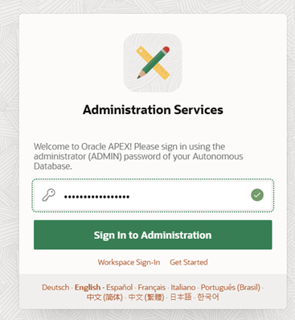
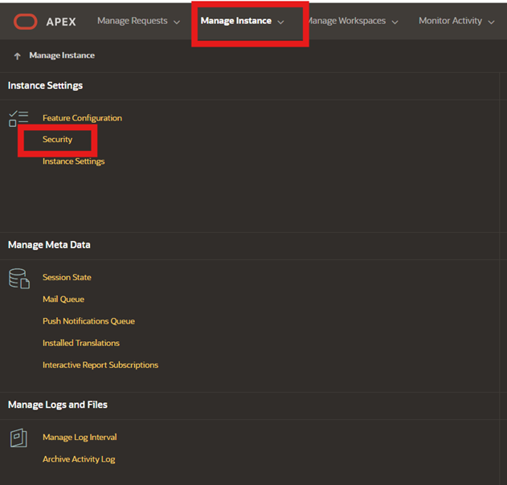
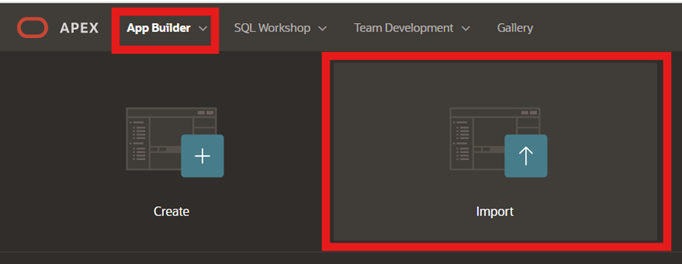
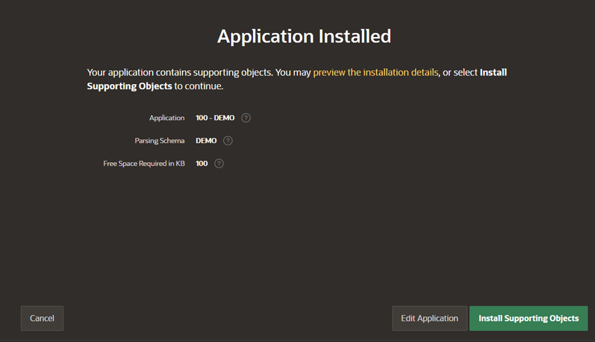

# Oracle APEX

## 📌 Introdução

>**O Oracle APEX (Application Express) é uma plataforma de desenvolvimento low-code que permite a criação rápida e fácil de aplicações seguras, escaláveis e altamente responsivas diretamente no Oracle Database, sem a necessidade de infraestrutura complexa.** 

### ➡️ **Como o Oracle APEX revoluciona o desenvolvimento de aplicações no Oracle Database?**

> Com o Oracle APEX, desenvolvedores podem criar aplicações empresariais modernas por meio de uma interface intuitiva que combina design visual, componentes integrados e funcionalidades avançadas, como gráficos interativos, relatórios dinâmicos e dashboards. O APEX aproveita as capacidades nativas do Oracle Database, como segurança, alta disponibilidade e desempenho, permitindo a criação de workspaces, o upload de aplicações e a integração com serviços externos via credenciais e APIs. Com poucos cliques, é possível importar arquivos SQL, configurar parâmetros de segurança e realizar customizações rápidas e eficientes.

 

### 📌 **Objetivos**

  Guiar os participantes na criação e configuração de um ambiente APEX no Oracle Cloud Infrastructure (OCI) para implementar uma aplicação baseada em IA generativa.  

O que você aprenderá:

  - Criar um workspace no APEX.  
  - Importar e instalar uma aplicação.  
  - Ajustar credenciais para integração com serviços do OCI.  
  - Realizar de testes práticos para validar a aplicação.  

 
### **Recursos e Suporte**:

- **Download da Aplicação**: [f102.sql](https://objectstorage.sa-saopaulo-1.oraclecloud.com/n/idi1o0a010nx/b/demo_externaltable/o/f102.sql)
- **Documentação da Oracle Cloud**: [Getting started with vectors in 23ai](https://blogs.oracle.com/coretec/post/getting-started-with-vectors-in-23ai)
- **Tutoriais**: [Oracle Database 23ai - Oracle AI Vector Search & Retrieval Augmented Generation (RAG) with Oracle APEX](https://www.linkedin.com/pulse/oracle-database-23ai-ai-vector-search-retrieval-augmented-rao-bqkcf/)

### _**Aproveite sua experiência na Oracle Cloud!**_

## 1️⃣ Criação de Workspace e Import de aplicação em ambiente APEX

Para acessar a URL da instância APEX na Console do Oracle Cloud Infrastructure (OCI), siga os passos a seguir. 

Inicialmente, retorne ao console da OCI. Em seguida, navegue até a página do seu Autonomous Database. Dentro da página da instância do banco de dados, localize e clique na opção **"Tool Configuration"**. Lá, você encontrará a URL da instância APEX. **Copie essa URL e abra em seu navegador.**

   

Na página que será aberta ao acessar a URL da instância APEX, **insira a senha de acesso ao workspace admin**. Recomendamos utilizar a senha **WORKSHOPsec2019##** para este propósito.
 

_VALIDAR -> Indicação de criação da senha WORKSHOPsec2019## deveria ser na etapa de criação do banco mas está aqui._

   

Em seguida, clique na opção **Create Workspace**. Na tela seguinte, escolha a opção **Existing Schema** para continuar com a criação do workspace utilizando um schema já existente.

   

Na sequência, preencha o formulário como o exemplo abaixo (recomendamos a senha WORKSHOPsec2019##). E clique em **Create Workspace** para finalizar.

   

Clique na aba superior **Manage Instance** e, em seguida, selecione **Security**.

   

Altere o parâmetro **Allow Public File Upload** para **Yes** e clique em **Apply Changes** para salvar as alterações.

   

Encerre a sessão do usuário **ADMIN** clicando em **Sign Out**, localizado na região superior direita da tela.

   

Faça o login no usuário **DEMO** criado nas etapas anteriores utilizando as credenciais de acesso indicadas abaixo.

   

Clique em **App Builder** e, em seguida, selecione **Import**.

   

Na página que será aberta, faça o upload do arquivo **f102.sql** utilizando o seguinte link: [f102.sql](https://objectstorage.sa-saopaulo-1.oraclecloud.com/n/idi1o0a010nx/b/demo_externaltable/o/f102.sql).

   

Aceite as configurações padrão e clique em **Install Application** para prosseguir com a instalação.

   

Clique em **Install Supporting Objects** para concluir a instalação dos objetos de suporte necessários.

   

Por fim, clique na aba **App Builder** para retornar à interface principal de desenvolvimento de aplicações.

   

## 👥 Agradecimentos

- **Autores** - Caio Oliveira
- **Autor Contribuinte** - Isabelle Anjos
- **Última Atualização Por/Data** - Janeiro 2025

## 🛡️ Declaração de Porto Seguro (Safe Harbor)

O tutorial apresentado tem como objetivo traçar a orientação dos nossos produtos em geral. É destinado somente a fins informativos e não pode ser incorporado a um contrato. Ele não representa um compromisso de entrega de qualquer tipo de material, código ou funcionalidade e não deve ser considerado em decisões de compra. O desenvolvimento, a liberação, a data de disponibilidade e a precificação de quaisquer funcionalidades ou recursos descritos para produtos da Oracle estão sujeitos a mudanças e são de critério exclusivo da Oracle Corporation.

Esta é a tradução de uma apresentação em inglês preparada para a sede da Oracle nos Estados Unidos. A tradução é realizada como cortesia e não está isenta de erros. Os recursos e funcionalidades podem não estar disponíveis em todos os países e idiomas. Caso tenha dúvidas, entre em contato com o representante de vendas da Oracle. 