# Oracle Generative AI Agents

## 📌 Introdução

>**O OCI Generative AI Agents é um serviço avançado que combina o poder dos grandes modelos de linguagem (LLMs) com técnicas de recuperação inteligente, permitindo que organizações desenvolvam agentes virtuais capazes de fornecer respostas contextuais e precisas ao consultar suas bases de conhecimento.** 

Referência: [Generative AI Agents](https://www.oracle.com/br/artificial-intelligence/generative-ai/agents/)

### ➡️ **Recursos principais**
Com funcionalidades avançadas, o OCI Generative AI Agents oferece uma experiência poderosa e eficiente.
- **Integração de dados e canais de interação:** Suporte a chat e API, facilitando a interação entre usuários e agentes.  
- **Respostas contextualmente relevantes:** As respostas são geradas com base em consultas inteligentes à base de conhecimento, garantindo precisão e contexto.  
- **Pesquisa híbrida:** Combina métodos léxicos e semânticos para alcançar maior assertividade nas respostas.  
- **Moderação de conteúdo:** Garante interações seguras e respeitosas com controles para entrada e saída de dados.  
- **Conversas multi-turn:** Permite que usuários façam perguntas de acompanhamento, com respostas que levam em conta o histórico da conversa.  
- **Interpretação de elementos visuais:** Capacidade de interpretar gráficos e tabelas em PDFs sem necessidade de descrições adicionais.  
- **Hiperlinks automáticos:** Os links presentes nos documentos são automaticamente extraídos e incluídos nas respostas.  

### ➡️ **Como o OCI Generative AI Agents revoluciona a interação com bases de conhecimento?**

O serviço transforma a forma como os agentes interagem ao:  

- **Aumentar a transparência e a rastreabilidade:** Cada resposta pode ser vinculada à sua fonte original, garantindo responsabilidade.  
- **Garantir atualizações contínuas:** Bases de conhecimento podem ser atualizadas sem interromper o funcionamento do agente.  
- **Oferecer escalabilidade e segurança:** Arquitetura robusta que suporta cargas crescentes sem comprometer a integridade dos dados.

 

### 📌 **Objetivos**

Descubrir como utilizar de forma prática a funcionalidade de busca vetorial do Oracle Generative AI Agents para otimizar consultas em documentos no formato PDF.

O que você aprenderá:

- Criar buckets no Object Storage e realizar o upload de documentos PDF.
- Configurar e utilizar o serviço OCI Generative AI Agent para criar bases de conhecimento e agentes conversacionais.
- Explorar como implementar a funcionalidade de Retrieval-Augmented Generation (RAG) para consultar documentos personalizados com eficiência e contexto.

 
### **Recursos e Suporte**:

- **Download do PDF**: [Normas Internas Dataprev](https://www.dataprev.gov.br/governanca/normativos/normasinternas). Para o nosso exemplo, utilizaremos o arquivo **Viagem a Serviço Nacional**.
- **Documentação da Oracle Cloud**: [Generative AI Agents](https://docs.oracle.com/pt-br/iaas/Content/generative-ai-agents/home.htm)
- **Tutoriais**: [Deploy an ODA Chatbot powered by Generative AI Agents](https://apexapps.oracle.com/pls/apex/f?p=133:180:2908048658105::::wid:4022)

### _**Aproveite sua experiência na Oracle Cloud!**_

## 1️⃣ Criação de Bucket no Object Storage e Upload de PDF

> **ATENÇÃO: Certifique-se de estar na região US Midwest (Chicago)**

Na guia do navegador com o OCI aberto, clique no menu de hambúrguer localizado no canto superior esquerdo da tela. Em seguida, selecione **Storage** e depois **Buckets**.

Clique em **Create Buckets**. Em seguida, insira um nome para o seu bucket. Recomendamos o nome **ai-agent-buckets**. Finalize clicando em **Create**.

Após a criação do bucket, clique em seu nome para acessá-lo. Em seguida, clique em **Upload**, selecione o arquivo PDF desejado do seu computador, **clique e arraste para a região delimitada** e finalize clicando em **Upload** na parte inferior da tela.

> **Observação: Você poderá adicionar o PDF utilizado na tarefa anterior, assim como outros PDFs à sua escolha.**

Aguarde a conclusão do processo. Em seguida, clique em **Close**. O arquivo deve aparecer em seu bucket como na imagem identificada abaixo.

## 2️⃣ Criação da Base de Conhecimento (Knowledge Base)

Clique no menu de hambúrguer localizado no canto superior esquerdo da tela. Em seguida, selecione Analytics & AI e depois Generative AI Agents.

Na página inicial do serviço, no menu à esquerda, selecione a opção **Knowledge Bases**.

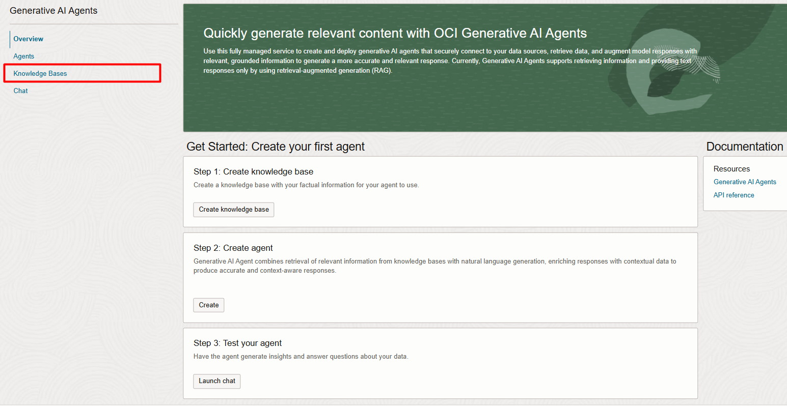

Selecione **Create Knowledge Base**, conforme indicado abaixo.

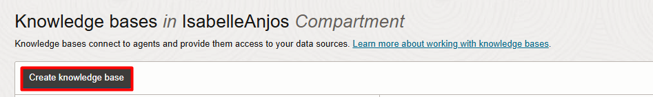

Nesta tela, siga os passos abaixo:  
1. Insira o nome da sua base de conhecimento. Recomendamos utilizar **knowledge-base-agent**.  
2. No campo **Data Source Type**, selecione a opção **Object Storage**.  
3. Selecione a opção **Enable Hybrid Search**, que combina pesquisa semântica (busca baseada no significado e contexto) e pesquisa lexical (busca por correspondência exata de termos), garantindo resultados mais precisos e relevantes.
4. Clique em **Specify Data Source** para configurar os arquivos que serão utilizados pelo Agent.  

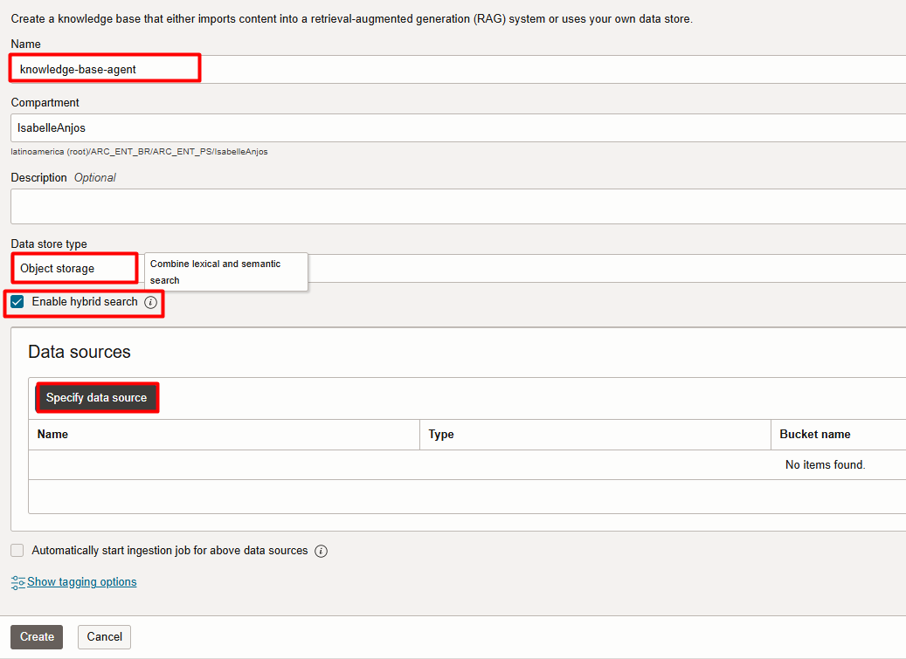

Na tela seguinte, siga os passos abaixo:
1.  Insira o nome da sua fonte de dados. Recomendamos utilizar **pdfs-dataprev**
2.  Marque a opção **Enable Multi-Modal Parsing** para permitir a interpretação de gráficos, tabelas e outros elementos visuais dos documentos.
3.  Em Select bucket, escolha o bucket previamente criado (neste exemplo, bucket-ai-agent).
4.  Marque a caixa ao lado de **Object prefixes** para selecionar os arquivos que serão utilizados. Você poderá escolher entre 1 ou mais arquivos.
5.  Clique em **Create** para finalizar a criação da fonte de dados.

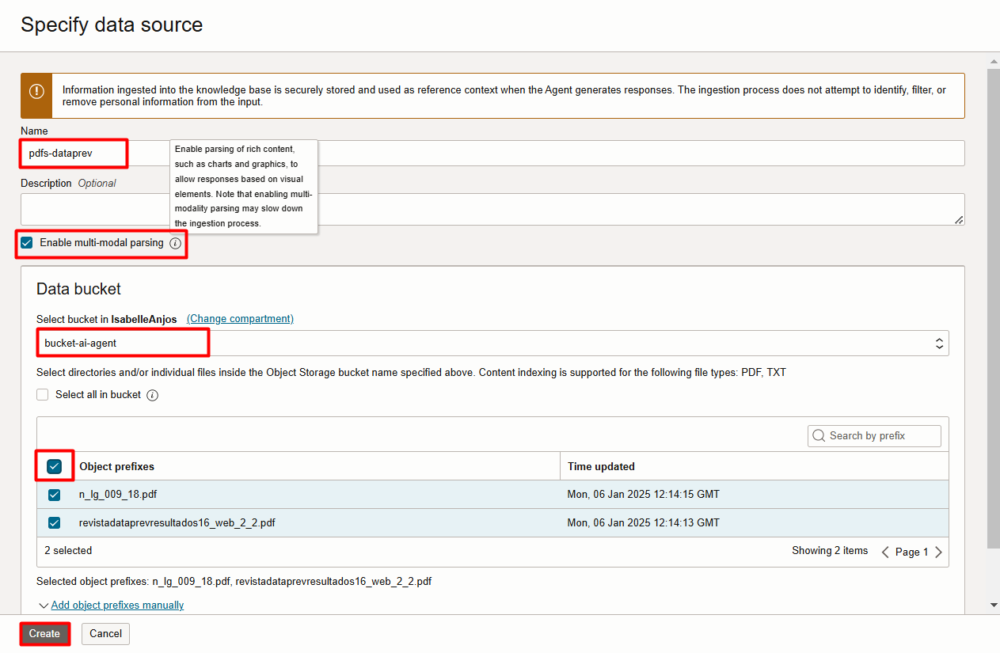

Na tela de criação da base de conhecimento, marque a opção **Automatically start ingestion job for above data sources**. Em seguida, clique em **Create**.

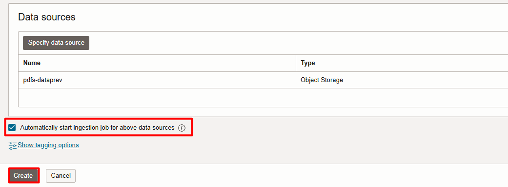

Verifique as mensagens no canto superior direito, indicando o sucesso na criação da base de conhecimento, da fonte de dados e do job de ingestão.

O status da base de conhecimento aparecerá como **Creating** até que o processo seja concluído, cuja média de tempo é de **3-5 minutos**. Aguarde a finalização antes de prosseguir.

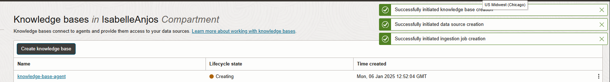

## 3️⃣ Criação do Agente de IA

No menu à esquerda, selecione a opção **Agents**. Em seguida, clique em **Create Agent**

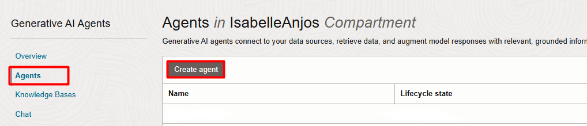

Nesta tela, siga os seguintes passos:
1. Insira o nome do agente. Recomendamos o nome **ai-agent**.
2. No campo **Welcome Message**, insira a mensagem de boas-vindas que será exibida para o usuário ao iniciar a interação com o agente. Exemplo: 
> **"Olá! Sou seu assistente virtual para documentos. Como posso ajudar você hoje?"**

3. No campo **Instructions for RAG Generation**, adicione instruções específicas para o agente. No exemplo, foi utilizado:  
> **"Você é um assistente virtual especialista em leitura de documentos. Responda sempre de forma clara e exclusivamente em português brasileiro."**

4. Na seção **Add Knowledge Bases**, selecione a base de conhecimento que será vinculada ao agente. Certifique-se de que a base de conhecimento está ativa. **O Lifecycle State deve aparecer como Active.**

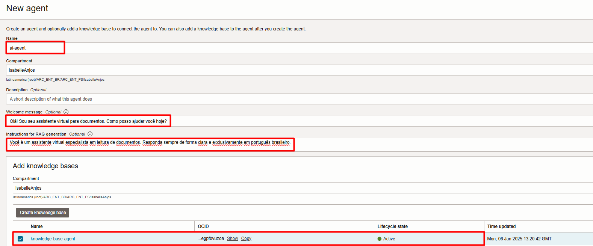

Certifique-se de que a opção **Automatically create an endpoint for this agent** está marcada. Isso permitirá que o sistema crie automaticamente um endpoint para o agente, facilitando a interação com ele via API com outras aplicações.

Clique no botão **Create** para finalizar a criação do agente.

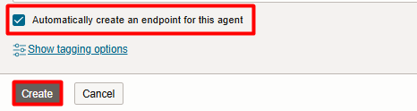

Nesta tela, aceite o Acordo de Licença e Política de Uso do Llama 3, o modelo de inteligência artificial utilizado pelo Agent.

No canto superior direito, verifique as mensagens de confirmação. Elas devem indicar que a criação do agente  e do endpoint foram concluídas com sucesso.

O campo **Lifecycle State** exibirá o status como **Creating**, com média de tempo  de **3-5 minutos** para finalização. Aguarde até que o status mude para **Active**, indicando que o agente está pronto para uso.

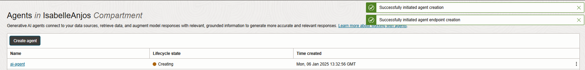

Clique no nome do agente e, em seguida, selecione a opção **Launch Chat** para iniciar a interação com o agente.

> **ATENÇÃO: Caso o agente esteja ativo e o botão não esteja disponível, acesse o menu à esquerda inferior e selecione Endpoints. Verifique se o Lifecycle State do endpoint está como Active. Se o status estiver como Creating, aguarde a finalização e atualize a página.**
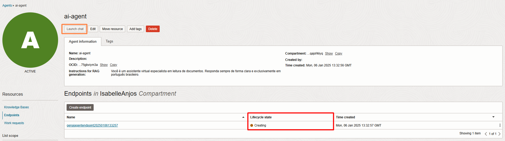

## 4️⃣ Interagindo com o Assistente

## 5️⃣ [EXTRA] Embeddings com OCI Generative AI

## 👥 Agradecimentos

- **Autores** - Caio Oliveira
- **Autor Contribuinte** - Isabelle Anjos
- **Última Atualização Por/Data** - Janeiro 2025

## 🛡️ Declaração de Porto Seguro (Safe Harbor)

O tutorial apresentado tem como objetivo traçar a orientação dos nossos produtos em geral. É destinado somente a fins informativos e não pode ser incorporado a um contrato. Ele não representa um compromisso de entrega de qualquer tipo de material, código ou funcionalidade e não deve ser considerado em decisões de compra. O desenvolvimento, a liberação, a data de disponibilidade e a precificação de quaisquer funcionalidades ou recursos descritos para produtos da Oracle estão sujeitos a mudanças e são de critério exclusivo da Oracle Corporation.

Esta é a tradução de uma apresentação em inglês preparada para a sede da Oracle nos Estados Unidos. A tradução é realizada como cortesia e não está isenta de erros. Os recursos e funcionalidades podem não estar disponíveis em todos os países e idiomas. Caso tenha dúvidas, entre em contato com o representante de vendas da Oracle. 
