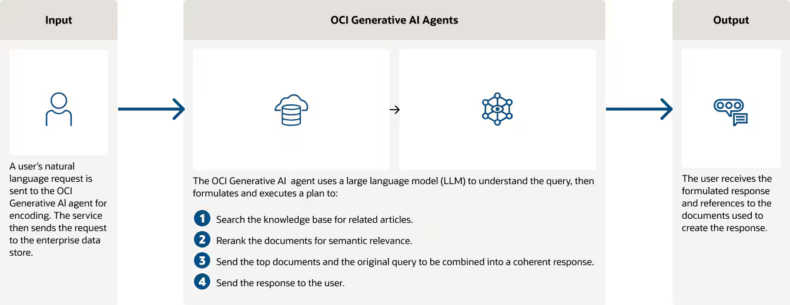
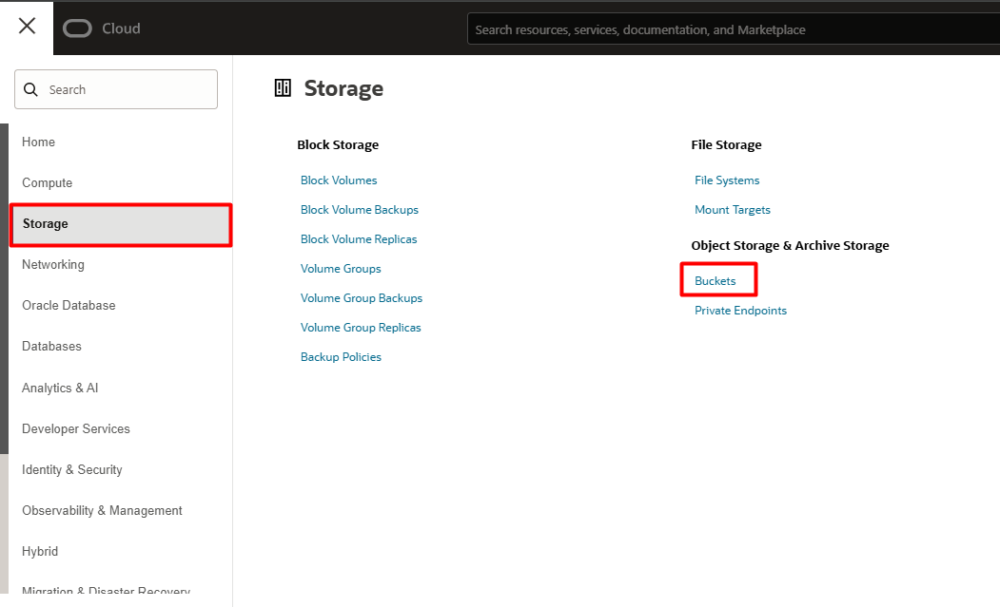
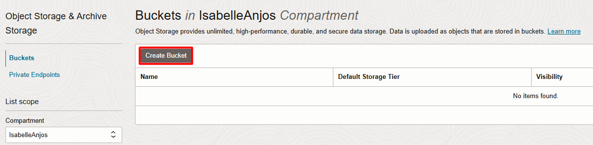
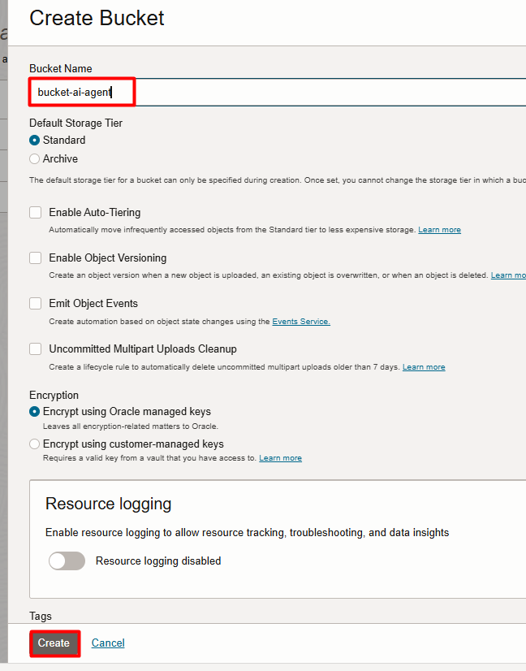
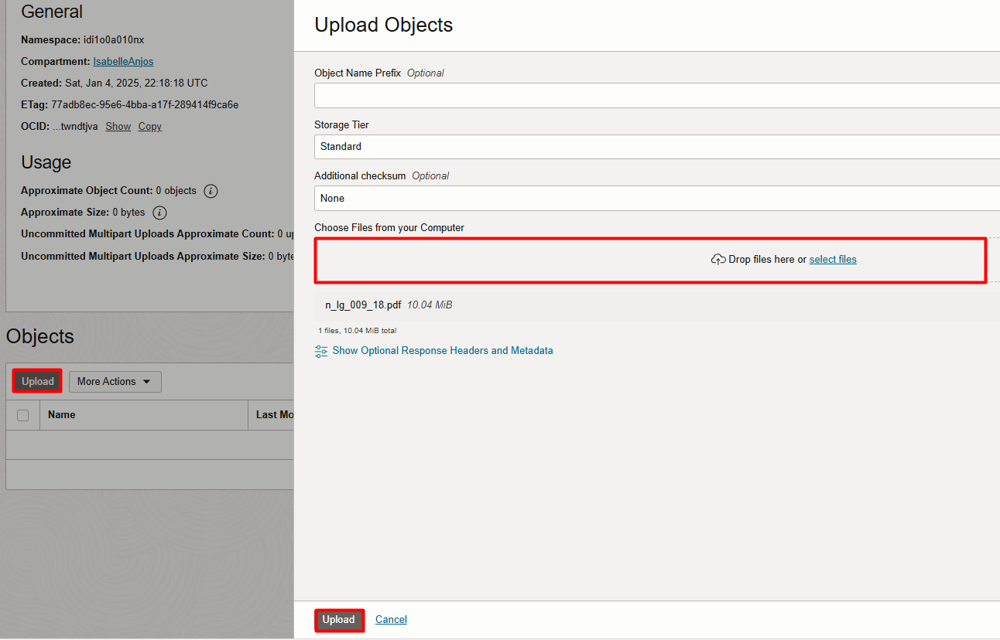
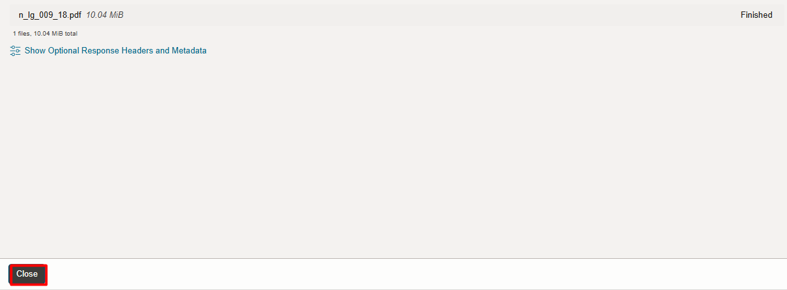
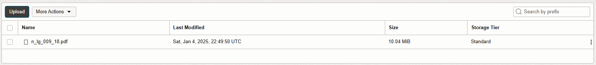
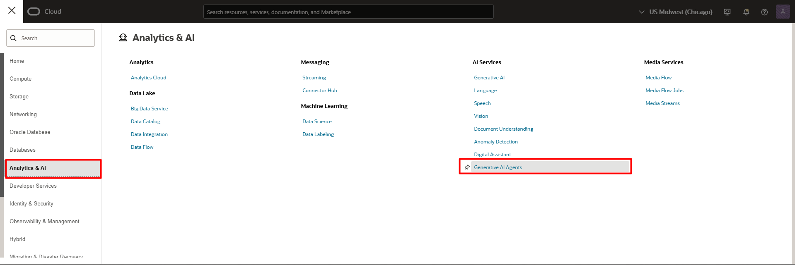

# Oracle 23ai Vector Search

## 📌 Introdução

>**O OCI Generative AI Agents é um serviço avançado que combina o poder dos grandes modelos de linguagem (LLMs) com técnicas de recuperação inteligente, permitindo que organizações desenvolvam agentes virtuais capazes de fornecer respostas contextuais e precisas ao consultar suas bases de conhecimento.** 

Referência: [Generative AI Agents](https://www.oracle.com/br/artificial-intelligence/generative-ai/agents/)

### ➡️ **Recursos principais**
Com funcionalidades avançadas, o OCI Generative AI Agents oferece uma experiência poderosa e eficiente.
- **Integração de dados e canais de interação:** Suporte a chat e API, facilitando a interação entre usuários e agentes.  
- **Respostas contextualmente relevantes:** As respostas são geradas com base em consultas inteligentes à base de conhecimento, garantindo precisão e contexto.  
- **Pesquisa híbrida:** Combina métodos léxicos e semânticos para alcançar maior assertividade nas respostas.  
- **Moderação de conteúdo:** Garante interações seguras e respeitosas com controles para entrada e saída de dados.  
- **Conversas multi-turn:** Permite que usuários façam perguntas de acompanhamento, com respostas que levam em conta o histórico da conversa.  
- **Interpretação de elementos visuais:** Capacidade de interpretar gráficos e tabelas em PDFs sem necessidade de descrições adicionais.  
- **Hiperlinks automáticos:** Os links presentes nos documentos são automaticamente extraídos e incluídos nas respostas.  

### ➡️ **Como o OCI Generative AI Agents revoluciona a interação com bases de conhecimento?**

O serviço transforma a forma como os agentes interagem ao:  

- **Aumentar a transparência e a rastreabilidade:** Cada resposta pode ser vinculada à sua fonte original, garantindo responsabilidade.  
- **Garantir atualizações contínuas:** Bases de conhecimento podem ser atualizadas sem interromper o funcionamento do agente.  
- **Oferecer escalabilidade e segurança:** Arquitetura robusta que suporta cargas crescentes sem comprometer a integridade dos dados.

 

### 📌 **Objetivos**

Descubrir como utilizar de forma prática a funcionalidade de busca vetorial do Oracle 23c AI Vector Search para otimizar consultas em documentos no formato PDF.

O que você aprenderá:

- Criar buckets no Object Storage e realizar o upload de documentos PDF.
- Configurar e utilizar o serviço OCI Generative AI Agent para criar bases de conhecimento e agentes conversacionais.
- Explorar como implementar a funcionalidade de Retrieval-Augmented Generation (RAG) para consultar documentos personalizados com eficiência e contexto.

 
### **Recursos e Suporte**:

- **Download do PDF**: [Normas Internas Dataprev](https://www.dataprev.gov.br/governanca/normativos/normasinternas). Para o nosso exemplo, utilizaremos o arquivo **Viagem a Serviço Nacional**.
- **Documentação da Oracle Cloud**: [Generative AI Agents](https://docs.oracle.com/pt-br/iaas/Content/generative-ai-agents/home.htm)
- **Tutoriais**: [Deploy an ODA Chatbot powered by Generative AI Agents](https://apexapps.oracle.com/pls/apex/f?p=133:180:2908048658105::::wid:4022)

### _**Aproveite sua experiência na Oracle Cloud!**_

## 1️⃣ Criação de Bucket no Object Storage e Upload de PDF

> **ATENÇÃO: Certifique-se de estar na região US Midwest (Chicago)**

Na guia do navegador com o OCI aberto, clique no menu de hambúrguer localizado no canto superior esquerdo da tela. Em seguida, selecione **Storage** e depois **Buckets**.

Clique em **Create Buckets**. Em seguida, insira um nome para o seu bucket. Recomendamos o nome **ai-agent-buckets**. Finalize clicando em **Create**.

Após a criação do bucket, clique em seu nome para acessá-lo. Em seguida, clique em **Upload**, selecione o arquivo PDF desejado do seu computador, **clique e arraste para a região delimitada** e finalize clicando em **Upload** na parte inferior da tela.

Aguarde a conclusão do processo. Em seguida, clique em **Close**. O arquivo deve aparecer em seu bucket como na imagem identificada abaixo.

## 2️⃣ Configuração do Generative AI Agents

Clique no menu de hambúrguer localizado no canto superior esquerdo da tela. Em seguida, selecione Analytics & AI e depois Generative AI Agents.

## 👥 Agradecimentos

- **Autores** - Caio Oliveira
- **Autor Contribuinte** - Isabelle Anjos
- **Última Atualização Por/Data** - Janeiro 2025

## 🛡️ Declaração de Porto Seguro (Safe Harbor)

O tutorial apresentado tem como objetivo traçar a orientação dos nossos produtos em geral. É destinado somente a fins informativos e não pode ser incorporado a um contrato. Ele não representa um compromisso de entrega de qualquer tipo de material, código ou funcionalidade e não deve ser considerado em decisões de compra. O desenvolvimento, a liberação, a data de disponibilidade e a precificação de quaisquer funcionalidades ou recursos descritos para produtos da Oracle estão sujeitos a mudanças e são de critério exclusivo da Oracle Corporation.

Esta é a tradução de uma apresentação em inglês preparada para a sede da Oracle nos Estados Unidos. A tradução é realizada como cortesia e não está isenta de erros. Os recursos e funcionalidades podem não estar disponíveis em todos os países e idiomas. Caso tenha dúvidas, entre em contato com o representante de vendas da Oracle. 
